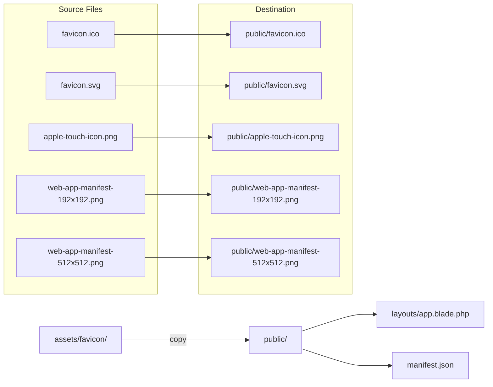

# Ash-Shiddiq Apps - Logo Update Plan

## Overview
Update all logo/favicon references across the Ash-Shiddiq Apps project to use the centralized logo files located in `assets/favicon/`.

---

## Source Files (assets/favicon/)

| Filename | Size/Type | Usage |
|----------|-----------|-------|
| `favicon.ico` | Multi-size ICO | Standard browser favicon |
| `favicon.svg` | SVG vector | Modern browser favicon |
| `favicon-96x96.png` | 96x96 PNG | Chrome Web Store / high-DPI |
| `apple-touch-icon.png` | iOS icon | Apple touch icon |
| `web-app-manifest-192x192.png` | 192x192 PNG | PWA icon (small) |
| `web-app-manifest-512x512.png` | 512x512 PNG | PWA icon (large) |
| `site.webmanifest` | Manifest file | Alternative PWA manifest |

---

## Step 1: Copy Files to Public Directory

**Action:** Copy all 7 files from `assets/favicon/` to `public/`

```
assets/favicon/favicon.ico          → public/favicon.ico
assets/favicon/favicon.svg          → public/favicon.svg
assets/favicon/favicon-96x96.png    → public/favicon-96x96.png
assets/favicon/apple-touch-icon.png → public/apple-touch-icon.png
assets/favicon/web-app-manifest-192x192.png → public/web-app-manifest-192x192.png
assets/favicon/web-app-manifest-512x512.png → public/web-app-manifest-512x512.png
assets/favicon/site.webmanifest     → public/site.webmanifest
```

**Note:** `public/favicon.ico` already exists and will be overwritten.

---

## Step 2: Update resources/views/layouts/app.blade.php

### Current Code (Line 7-9):
```html
<meta name="theme-color" content="#1a1a2e">
<link rel="apple-touch-icon" href="/icon.png">
<link rel="manifest" href="/manifest.json">
```

### New Code (Line 7-15):
```html
<meta name="theme-color" content="#1a1a2e">

<!-- Favicon -->
<link rel="icon" type="image/x-icon" href="/favicon.ico">
<link rel="icon" type="image/svg+xml" href="/favicon.svg">
<link rel="icon" type="image/png" sizes="96x96" href="/favicon-96x96.png">
<link rel="apple-touch-icon" href="/apple-touch-icon.png">
<link rel="manifest" href="/site.webmanifest">
```

**Changes:**
- Line 8: `/icon.png` → `/apple-touch-icon.png`
- Line 9: `/manifest.json` → `/site.webmanifest`
- Added 3 new favicon link tags for broader browser support

---

## Step 3: Update public/manifest.json

### Current Content:
```json
{
    "name": "Pesantren Digital",
    "short_name": "Pesantren",
    "description": "Aplikasi Manajemen Pesantren Terpadu",
    "start_url": "/",
    "display": "standalone",
    "background_color": "#1a1a2e",
    "theme_color": "#1a1a2e",
    "orientation": "portrait",
    "icons": [
        {
            "src": "/icon-192x192.png",
            "sizes": "192x192",
            "type": "image/png"
        },
        {
            "src": "/icon-512x512.png",
            "sizes": "512x512",
            "type": "image/png"
        }
    ]
}
```

### New Content:
```json
{
    "name": "Ash-Shiddiq Apps",
    "short_name": "Ash-Shiddiq",
    "description": "Aplikasi Manajemen Pesantren Ash-Shiddiq",
    "start_url": "/",
    "display": "standalone",
    "background_color": "#1a1a2e",
    "theme_color": "#1a1a2e",
    "orientation": "portrait",
    "icons": [
        {
            "src": "/web-app-manifest-192x192.png",
            "sizes": "192x192",
            "type": "image/png"
        },
        {
            "src": "/web-app-manifest-512x512.png",
            "sizes": "512x512",
            "type": "image/png"
        }
    ]
}
```

**Changes:**
- Icon src paths updated to match actual filenames
- App name updated to "Ash-Shiddiq Apps"
- Short name updated to "Ash-Shiddiq"
- Description updated to include "Ash-Shiddiq"

---

## Visual Summary



---

## Files Modified

| File | Action | Lines Changed |
|------|--------|---------------|
| `public/favicon.ico` | Overwrite | - |
| `public/favicon.svg` | Create | New |
| `public/favicon-96x96.png` | Create | New |
| `public/apple-touch-icon.png` | Create | New |
| `public/web-app-manifest-192x192.png` | Create | New |
| `public/web-app-manifest-512x512.png` | Create | New |
| `public/site.webmanifest` | Create | New |
| `resources/views/layouts/app.blade.php` | Edit | ~7-9 |
| `public/manifest.json` | Edit | ~1-22 |

---

## Verification Checklist

After implementation, verify:
- [ ] Browser tab shows Ash-Shiddiq favicon
- [ ] Adding to home screen on iOS uses apple-touch-icon.png
- [ ] PWA install uses correct 192x192 and 512x512 icons
- [ ] Manifest shows "Ash-Shiddiq Apps" as app name
- [ ] No broken image icons in browser dev tools
